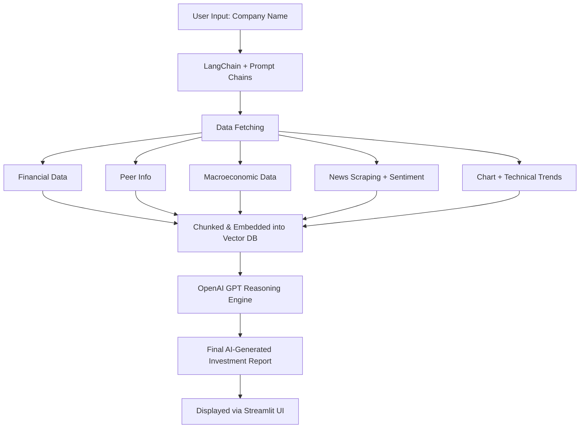

# ValuateGPT — 360° Autonomous Financial Research Assistant

**ValuateGPT** is your AI-powered equity research analyst that performs a **complete 360° investment analysis**—including **Financial, Peer, Technical, Macro**, and **News Analysis**—by simply entering a company name or stock ticker. No manual uploads or digging for data—just type a company name, and let ValuateGPT do the rest.

---

## What Makes ValuateGPT Unique?

💡 Just enter the company name or stock ticker (e.g., `TCS`, `AAPL`, `RELIANCE`), and it automatically performs:

🔢 **Financial Analysis**  
→ Understand business model, key financials, growth drivers, risks, and profitability insights

🤝 **Peer Comparison**  
→ Automatically identifies and compares key competitors across performance and positioning

📈 **Technical Analysis**  
→ Fetches and interprets technical values, price movement trends, and trading signals

🌎 **Macroeconomic Analysis**  
→ Links the company’s performance to GDP, inflation, interest rates, and global trends

📰 **News Analysis**  
→ Summarizes latest news headlines, extracts sentiment, and flags relevant developments

🧠 **AI-Powered Recommendations**  
→ Combines all insights to deliver actionable investment narratives

---

## 🖼️ UI Preview

> Here’s what the homepage looks like. Just enter a company name and your OpenAI API key:


---

## How It Works (Architecture)
<details> <summary>📊 <strong>System Architecture</strong> (Click to Expand)</summary>
    

</details>


## 🧱 Tech Stack

| Layer              | Tech Used                         |
|--------------------|----------------------------------|
| **UI**             | Streamlit                        |
| **AI Reasoning**    | OpenAI GPT-4 via LangChain      |
| **Data Layer**      | yFinance, News APIs, Macro APIs  |
| **Vector Storage**  | FAISS                           |
| **PDF Parsing (WIP)**| LangChain PDF Loader            |
| **Charting**        | Matplotlib, yFinance (coming soon) |

## 🚀 Getting Started Locally

1. **Clone This Repository**

   ```bash
   git clone https://github.com/yourusername/ValuateGPT.git
   cd ValuateGPT

2. **Install Dependencies**
   ```bash
   pip install -r requirements.txt

3. **Add Your API Key**

Create a .env file and add your OpenAI API key:
   ```bash
   OPENAI_API_KEY=your_openai_key

Or enter your key on the app’s homepage.

4. **Launch the App**
    ```bash
    streamlit run app.py

## 🙌 Built With

- OpenAI  
- LangChain  
- Streamlit  
- yFinance  
- BeautifulSoup  


## 👨‍💻 Created by
Vatsal Mishra — Founder of Engaj Media  
📬 Connect on [[LinkedIn](https://www.linkedin.com/in/vatsalmishra-/)]
